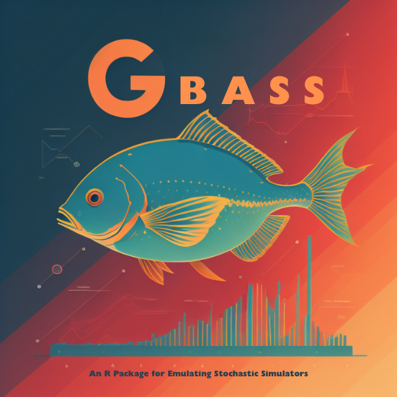

<!-- README.md is generated from README.Rmd. Please edit that file -->

# GBASS - An Emulator for Stochastic Computer Models

[](https://www.gnu.org/licenses/gpl-3.0)
[](https://github.com/knrumsey-lanl/GBASS)

<div class="figure">


<p class="caption">
This logo was designed by Imagine AI Art Studio
</p>

</div>

### Description

GBASS (Generalized Bayesian Additive Spline Surfaces) is an R package
for fitting [BASS](https://github.com/cran/BASS) models with flexible
likelihoods including the $t$, Horseshoe, Asymmetric Laplace (for
quantile regression) and Normal-Wald likelihoods. The package provides
an implementation of the method proposed in [Rumsey et.
al. (2023)](https://arxiv.org/pdf/2306.01911). To work with the
`gbass()` function, priors for the global variance factor $w$ and local
variance factors $v_i$ should be specified as a GIG prior (or a GBP
prior). Helpful wrappers `tbass()`, `qbass()` and `nwbass()` are also
provided for some important familiar cases.

### Installation

To install the `GBASS` package, type

``` r
# install.packages("devtools")
devtools::install_github("knrumsey/GBASS")
```

# Copyright Notice

*© 2021. Triad National Security, LLC. All rights reserved.*

*This program was produced under U.S. Government contract
89233218CNA000001 for Los Alamos National Laboratory (LANL), which is
operated by Triad National Security, LLC for the U.S. Department of
Energy/National Nuclear Security Administration. All rights in the
program are reserved by Triad National Security, LLC, and the U.S.
Department of Energy/National Nuclear Security Administration. The
Government is granted for itself and others acting on its behalf a
nonexclusive, paid-up, irrevocable worldwide license in this material to
reproduce, prepare derivative works, distribute copies to the public,
perform publicly and display publicly, and to permit others to do so.*
