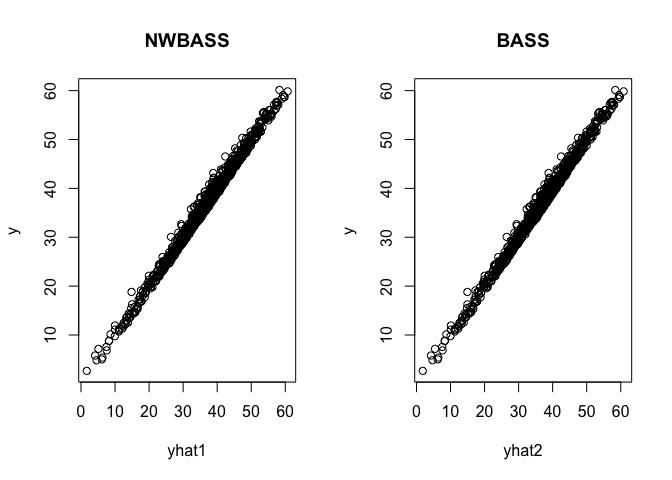
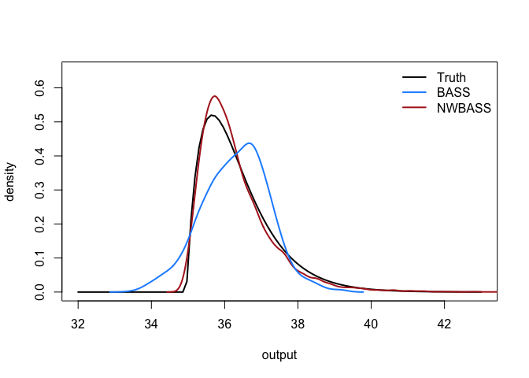

<!-- README.md is generated from README.Rmd. Please edit that file -->

# GBASS - An Emulator for Stochastic Computer Models

[](https://www.gnu.org/licenses/gpl-3.0)
[](https://github.com/knrumsey-lanl/GBASS)

<div class="figure">


<p class="caption">

This logo was designed by Imagine AI Art Studio
</p>

</div>

### Description

GBASS (Generalized Bayesian Adaptive Smoothing Splines) is an R package
for fitting [BASS](https://github.com/cran/BASS)-style models with
flexible likelihoods, including the Student’s $t$, Horseshoe, asymmetric
Laplace (for quantile regression), and Normal-Wald likelihoods. The
package provides an implementation of the methods proposed in [Rumsey et
al. (2023)](https://epubs.siam.org/doi/full/10.1137/23M1577122), while
retaining a familiar interface for users of `BASS`.

To work directly with `gbass()`, priors for the global variance factor
$w$ and local variance factors $v_i$ should be specified using either a
generalized inverse Gaussian (GIG) prior or a generalized beta prime
(GBP) prior. Helpful wrappers `tbass()`, `qbass()`, `hbass()`, and
`nwbass()` are also provided for important special cases.

### Installation

To install the `GBASS` package, type

``` r
# install.packages("remotes")
remotes::install_github("knrumsey/GBASS")
```

### Example

The example below compares `nwbass()` to a standard `bass()` model on a
simple stochastic emulator problem with skewed response behavior.

    #> 
    #> Attaching package: 'BASS'
    #> The following object is masked from 'package:GBASS':
    #> 
    #>     sobol
    #> Warning: package 'lhs' was built under R version 4.4.3



In this example, `nwbass()` is able to capture the asymmetric predictive
distribution much better than a Gaussian `bass()` model.

### References

Rumsey, K.N., Francom, D. and Shen, A., 2024. Generalized Bayesian MARS:
Tools for stochastic computer model emulation. SIAM/ASA Journal on
Uncertainty Quantification, 12(2), pp.646-666.

# Copyright Notice

*© 2021. Triad National Security, LLC. All rights reserved.*

*This program was produced under U.S. Government contract
89233218CNA000001 for Los Alamos National Laboratory (LANL), which is
operated by Triad National Security, LLC for the U.S. Department of
Energy/National Nuclear Security Administration. All rights in the
program are reserved by Triad National Security, LLC, and the U.S.
Department of Energy/National Nuclear Security Administration. The
Government is granted for itself and others acting on its behalf a
nonexclusive, paid-up, irrevocable worldwide license in this material to
reproduce, prepare derivative works, distribute copies to the public,
perform publicly and display publicly, and to permit others to do so.*
