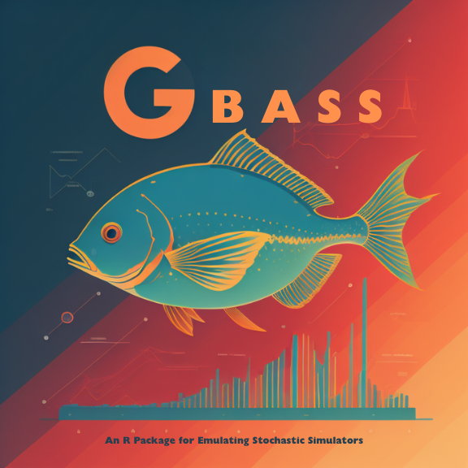

<!-- README.md is generated from README.Rmd. Please edit that file -->

```{r, include = FALSE}
knitr::opts_chunk$set(
  collapse = TRUE,
  eval = FALSE,
  comment = "#>",
  fig.path = "man/figures/README-",
  out.width = "100%"
)
library(knitr)
```

# GBASS - An Emulator for Stochastic Computer Models

[](https://www.gnu.org/licenses/gpl-3.0)
[](https://github.com/knrumsey-lanl/GBASS)


```{r, eval=TRUE, echo=FALSE, fig.cap="This logo was designed by Imagine AI Art Studio", out.width='50%'}

```


### Description 

GBASS (Generalized Bayesian Adaptive Smoothing Splines) is an R package for fitting [BASS](https://github.com/cran/BASS)-style models with flexible likelihoods, including the Student's $t$, Horseshoe, asymmetric Laplace (for quantile regression), and Normal-Wald likelihoods. The package provides an implementation of the methods proposed in [Rumsey et al. (2023)](https://epubs.siam.org/doi/full/10.1137/23M1577122), while retaining a familiar interface for users of `BASS`.

To work directly with `gbass()`, priors for the global variance factor $w$ and local variance factors $v_i$ should be specified using either a generalized inverse Gaussian (GIG) prior or a generalized beta prime (GBP) prior. Helpful wrappers `tbass()`, `qbass()`, `hbass()`, and `nwbass()` are also provided for important special cases.


### Installation

To install the `GBASS` package, type

```{R}
# install.packages("remotes")
remotes::install_github("knrumsey/GBASS")
```

### Example
The example below compares `nwbass()` to a standard `bass()` model on a simple stochastic emulator problem with skewed response behavior.

```{r example, eval=TRUE, echo=FALSE, fig.height=5, fig.width=7}
library(GBASS)
library(BASS)
library(lhs)

# Define function
dms_simple <- function(x) 10.391 * ((x[1] - 0.4) * (x[2] - 0.6) + 0.36)

# Get data
X <- maximinLHS(1000, 2)
y <- 10 * apply(X, 1, dms_simple) + (rgamma(1000, 2, 0.05) - 40) / sqrt(2 / 0.05^2)

# Fit NWBASS model
mod1 <- nwbass(
  X, y,
  s_beta = 10, m_gamma = 100, s_gamma = 30,
  verbose=FALSE
)

# Fit regular BASS model
mod2 <- bass(X, y, verbose=FALSE)

# Look at predictions
pred1 <- predict(mod1, X, predictive=FALSE, bias_correct=TRUE)
pred2 <- predict(mod2, X, nugget=FALSE)

yhat1 <- colMeans(pred1)
yhat2 <- colMeans(pred2)

par(mfrow=c(1,2))
plot(yhat1, y, main="NWBASS")
plot(yhat2, y, main="BASS")
par(mfrow=c(1,1))

# Pick a reference point
xx <- c(0.5, 0.5)

# Plot the true response distribution
curve(
  28.28 * dgamma(28.28 * x - 28.28 * 10 * dms_simple(xx) + 40, 2, 0.05),
  from = 32, to = 43,
  xlab = "output", ylab = "density",
  lwd = 2,
  ylim = c(0, 0.65)
)

# Plot the predicted response distribution based on NWBASS
preds1 <- predict(mod1, matrix(xx, nrow = 1), predictive = TRUE, samples = 10)
d1 <- density(preds1)
lines(d1, col = "firebrick", lwd = 2)

# Plot the predicted response distribution based on BASS
preds2 <- predict(mod2, matrix(xx, nrow = 1), nugget = TRUE)
d2 <- density(preds2)
lines(d2, col = "dodgerblue", lwd = 2)

# Add legend
legend(
  "topright",
  legend = c("Truth", "BASS", "NWBASS"),
  col = c("black", "dodgerblue", "firebrick"),
  lwd = 2,
  bty = "n"
)
```

In this example, `nwbass()` is able to capture the asymmetric predictive distribution much better than a Gaussian `bass()` model.


### References

Rumsey, K.N., Francom, D. and Shen, A., 2024. Generalized Bayesian MARS: Tools for stochastic computer model emulation. SIAM/ASA Journal on Uncertainty Quantification, 12(2), pp.646-666.

# Copyright Notice

*© 2021. Triad National Security, LLC. All rights reserved.*

*This program was produced under U.S. Government contract 89233218CNA000001 for Los Alamos National Laboratory (LANL), which is operated by Triad National Security, LLC for the U.S. Department of Energy/National Nuclear Security Administration. All rights in the program are reserved by Triad National Security, LLC, and the U.S. Department of Energy/National Nuclear Security Administration. The Government is granted for itself and others acting on its behalf a nonexclusive, paid-up, irrevocable worldwide license in this material to reproduce, prepare derivative works, distribute copies to the public, perform publicly and display publicly, and to permit others to do so.* 


